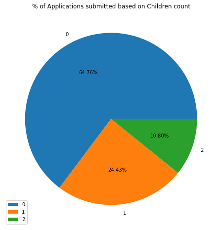

# Laporan Proyek Machine Learning - Faisal Mashuri
## Domain Proyek
Kegagalan untuk mengidentifikasi risiko kredit menyebabkan hilangnya pendapatan dan memperluas risiko kredit macet menjadi ancaman bagi profitabilitas. Kesalahan dalam analisis kredit menimbulkan risiko kredit, seperti kehilangan nasabah, ketidakpastian pengembalian pinjaman, bahkan ketidakmampuan nasabah untuk mengembalikan pinjaman (Zurada & Kunene, 2011).

Teknik klasifikasi pada machine learning dapat digunakan untuk menentukan risiko kredit. Misalnya di bank, sifat nasabah yang bisa membayar pinjamannya dapat di prediksi dan model dapat dibuat dengan menggunakan kumpulan data sebelumnya tentang pendanaan nasabah. Setelah itu model dapat digunakan pada yang baru. Pelanggan untuk menentukan kemungkinan membayar kembali kredit mereka. Dalam metode deskriptif, hubungan dapat dicari antara dua kumpulan data, misalnya kebiasaan berbelanja dari dua budaya yang berbeda dapat diselidiki kesamaannya.

Dalam memprediksi resiko pemberian kredit, maka diperlukannya sebuah sistem yang dapat memprediksi hal tersebut seperti machine learning. Teknik machine learning menjadi sangat populer saat ini karena ketersediaannya luas dalam kuantitas data yang besar serta kebutuhan kita untuk dapat mengubah data menjadi suatu pengetahuan. Kebutuhan akan pengetahuan inilah yang akhirnya mendorong industri TI untuk menggunakan machine learning. Data mining adalah proses mencari pola atau informasi. 

## Business Understanding
### Problem Statements
Berdasarkan latar belakang yang sudah dipaparkan sebelumnya, berikut rincian masalah yang dapat diselesaikan dalam proyek ini :
- Bagaimana cara melakukan preprocessing pada data yang tidak seimbang atau imbalance data untuk membuat model machine learning yang baik?
- Bagaimana cara membuat model machine learning untuk menentukan persetujuan pengajuan kredit?

## Goals:
- Melakukan preprocessing pada data yang tidak seimbang atau imlanace data untuk membuat model machine learning yang baik.
- Membuat model machine learning untuk menentukan persetujuan pengajuan kredit

## Solution Statements
- Menggunakan EDA untuk melihat fitur – fitur yang berkorelasi dan berpengaruh terhadap persetujuan pengajuan kredit
- Menggunakan berbagai model machine learning untuk mengetahui kemungkinan terbesar penumpang – penumpang yang selamat lewat data yang diberikan. Model - model yang akan dipakai adalah model - model machine learning klasifikasi. Kemudian kita akan memilih model mana yang memiliki tingkat akurasi paling tinggi, model – model yang akan dibuat adalah:
    * Support Vector Machine
    * XGBClassifier

## Data Understanding
Untuk data set saya menggunakan dataset dari kaggle yang dapat dilihat pada dibawah ini :
| Jenis | Keterangan | 
| ----------- | :---------: | 
| Sumber | https://www.kaggle.com/rikdifos/credit-card-approval-prediction | 
| Kategori | Layak (0) dan Tidak Layak(1)| 
 
Variabel-variabel pada dataset adalah sebagai berikut:
1. ID: id unik pada tiap baris
2. CODE_GENDER: kode jenis kelamin. M adalah laki- laki dan F dan perempuan.
3. FLAG_OWN_CAR: kolom yang menunjukan kepemilikan mobil. Y adalah Yes dan N adalah NO.
4. FLAG_OWN_REALTY: kolom yang menunjukan realitas. Y adalah Yes dan N adalah No.
5. CNT_CHILDREN: Jumlah anak.
6. AMT_INCOME_TOTAL: Total income.
7. NAME_INCOME_TYPE: jenis income.
8. NAME_EDUCATION_TYPE: jenis edukasi.
9. NAME_FAMILY_STATUS: jenis status keluarga.
10. DAYS_BIRTH: Hari lahir.
11. DAYS_EMPLOYED: jumlah hari menjadi pegawai.
12. FLAG_MOBILE: kolom yang menunjukan kepemilikan mobile phone. 1 is True and 0 is False.
13. FLAG_WORK_PHONE: kolom yang menunjukan kepemilikan telpon kantor 1 is True and 0 is False.
14. FLAG_PHONE: kolom yang menunjukan kepemilikan telpon rumah. 1 is True and 0 is False.
15. FLAG_EMAIL: kolom yang menunjukan kepemilikan email. 1 is True and 0 is False.
16. OCCUPATION_TYPE: jenis pekerjaan. 
17. CNT_FAM_MEMBERS: Jumlah anggota keluarga.

Statistik deskriptif data :

Kolom Numerik dan Categorical :

Null values :

Outliers :

### Visualisasi

- Aplikasi yang dikirim berdasarkan gender  

- Aplikasi yang disetujui berdasarkan gender  

- Aplikasi yang dikirim berdasarkan kepemilikan mobil  

- Aplikasi yang dikirim berdasarkan kepemilikan porperti  

- Aplikasi yang dikirim berdasarkan jumlah anak  

- Histogram total income   

- Aplikasi yang dikirim berdasarkan jenis income  

- Aplikasi yang dikirim berdasarkan status keluarga  

- Aplikasi yang dikirim berdasarkan tipe tempat tinggal  

- Aplikasi yang dikirim berdasarkan age  

- Heatmap correlation dari tiap atribut  

## Data Preparation

- Mengatasi pencilan atau outlier  
Pada tahapan ini berguna untuk menghapus data tidak normal pada dataset dengan menggunakan teknik IQR method. IQR merupakan interquartile yang dapat diformulasikan Q3 - Q1. 
Untuk mendeteksi pencilan langkah pertama mengalikan IQR dengan 1.5. Kemudian tentukan batas bawah dan batas atas dengan cara, batas bawah = Q1 - 1.5 * IQR dan batas atas = Q3 + 1.5 * IQR. 
Maka data yang bukan outlier adalah data yang berapa pada rentang batas bawah hingga batas atas.

- Membagi data menjadi data training dan testing  
Tahapan ini bertujuan agar model yang dilatih dapat diuji dengan data yang berbeda dari data yang digunakan dalam pelatihan. Data dapat dibagi menjadi dua atau tiga, pada proyek ini data dibagi menjadi dua dengan persentase untuk training sebesar 80% dan sisanya 20% untuk testing. Fungsi train_test_split pada library sklearn yang akan digunakan untuk menangani tahapan ini.

- Transformasi pada kolom categorical  
Mesin hanya dapat membaca angka berupa nol dan satu, oleh karenanya perlu adanya mekanisme untuk membuat mesin bisa menerima masukan berupa karakter, string maupun object. Proses transformasi pada fitur kategorikal sering kali disebut encoding. pada kali ini encoding yang digunakan adalah OneHotEncoder

- Melakukan scaling  
pada percobaan kali ini saya menggunakan MinMaxScaler. Min-Max Scaling, yang sering dikenal juga dengan normalisasi data atau normalization (karena z-score juga sering disebut normalization, maka sering terjadi ambiguitas atau tertukar-tukar.
Min-Max Scaling bekerja dengan scaling data/menyesuaikan data dalam rentang/range tertentu (range nilai minimum hingga nilai maksimum), dengan rentang yang biasa digunakan adalah 0 hingga 1

- Merge Dataset  
disini saya melakuakan merge data credit_record yang berisi riwayat pengajuan kredit dengan dataset apllication_record yang berisi tentang status approval pengajuan kredit dari data credit_record 

- Membuat Pipeline 
Pada tahapan sebelumnya telah dipaparkan mengapa penting membagi data menjadi data training dan testing. Data testing haruslah data yang benar-benar belum pernah dilihat oleh model. Oleh karenanya pada tahap pre-processing seperti transformasi, penyekalaan harus dilakukan pada data testing saja. Jika penyelakaan atau transformasi dilakukan terhadap semua data dalam tanda kutip dilakukan sebelum pembagian data train dan testing akan menyebabkan kebocoran data yang dapat menyebabkan model menjadi overfit kedepannya. Kebocoran data adalah suatu momen ketika model sudah pernah melihat data testing. Bisa dianalogikan seperti seorang yang sedang berlatih untuk ujian dan mendapatkan bocoran mengenai ujian pertama, maka pada ujian pertama dia akan mendapatkan nilai yang baik namun jika ada ujian kedua belum tentu akan mendapat nilai yang baik. Oleh karenanya untuk mengukur seseorang menguasai materi dengan baik haruslah diuji dengan soal atau ujian yang belum pernah dikerjakan sebelumnya. Apa hubungannya dengan pipeline ? jika dalam preprocessing tersebut dilakukan secara manual akan banyak sekali tahapan dan variabel yang perlu diingat. Sebagai contoh misal dalam menangani data kosong dengan rata-rata, nilai rata-rata tersebut harus diingat ketika ingin menyekalakan data testing. Berikut ilustrasi dari pipeline dalam proyek ini.    

 
 
 
## Modeling
Model – model yang saya pakai dalam projek ini adalah:

### SVM
Support Vector Machine (SVM) merupakan salah satu metode dalam supervised learning yang biasanya digunakan untuk regresi (Support Vector Regression).SVM digunakan untuk mencari hyperplane terbaik dengan memaksimalkan jarak antar kelas. Hyperplane adalah sebuah fungsi yang dapat digunakan untuk pemisah antar kelas. Dalam 2-D fungsi yang digunakan untuk klasifikasi antar kelas disebut sebagai line whereas, fungsi yang digunakan untuk klasifikasi antas kelas dalam 3-D disebut plane similarly, sedangan fungsi yang digunakan untuk klasifikasi di dalam ruang kelas dimensi yang lebih tinggi di sebut hyperplane.
- Pipeline SVM  

 
Parameter yang digunakan pada model SVM antara lain :  
disini saya menggunakan parameter default dari SVM untuk regresi dan hanya mengganti kernelnya menjadi linear.     

### XGBoost
XGBoost atau eXtreme Gradient Boosting adalah algoritma berbasis pohon. XGBoost adalah bagian dari keluarga pohon (Decision tree, Random Forest, bagging, boosting, gradient boosting). Kekuatan XGBoost adalah paralelisme dan pengoptimalan perangkat keras. Data disimpan dalam memori, disebut blok, dan disimpan dalam format kolom terkompresi [CSC]. Algoritma tersebut dapat melakukan pemangkasan pohon untuk menghilangkan cabang yang probabilitasnya rendah. Fungsi kerugian model memiliki istilah untuk menghukum kompleksitas model dengan regularisasi untuk memperlancar proses pembelajaran (mengurangi kemungkinan overfitting).
- Pipeline XGBoost 

## Evaluasi
Metrik evaluasi adalah dasar yang digunakan untuk menentukan performa model dan model pemenang ditempatkan di papan peringkat.
Matriks konfusi adalah metode umum yang digunakan untuk menentukan dan memvisualisasikan kinerja model klasifikasi. Matriks konfusi adalah matriks NxN dengan N adalah jumlah kelas atau nilai target.

Baris dalam matriks kebingungan mewakili nilai aktual sedangkan kolom mewakili nilai prediksi.

Istilah yang perlu diperhatikan dalam Confusion Matrix
 - Positif benar : Positif benar terjadi jika model telah memprediksi instance Benar dengan benar.
 - True Negatives : True negative adalah kasus ketika model secara akurat memprediksi instance False.
 - Positif palsu : Positif palsu adalah situasi di mana model telah memprediksi nilai True ketika nilai sebenarnya adalah False.
 - Negatif palsu : Negatif palsu adalah situasi di mana model memprediksi nilai False ketika nilai sebenarnya adalah True.
 

Berikut adalah tabel evaluasi dari kedua model:

- Metrik akurasi mengukur jumlah kelas yang diprediksi dengan benar oleh model - true positive dan true negative.

    

- Mean Squared Error (MSE) adalah Rata-rata Kesalahan kuadrat diantara nilai aktual dan nilai peramalan. Metode Mean Squared Error secara umum digunakan untuk mengecek estimasi berapa nilai kesalahan pada peramalan. Nilai Mean Squared Error yang rendah atau nilai mean squared error mendekati nol menunjukkan bahwa hasil peramalan sesuai dengan data aktual dan bisa dijadikan untuk perhitungan peramalan di periode mendatang. Metode Mean Squared Error biasanya digunakan untuk mengevaluasi metode pengukuran dengan model regressi

    

 

dan berikut adalah confusion matrix dari model SVM

Berikut confusion matrix dari model XGBoost

